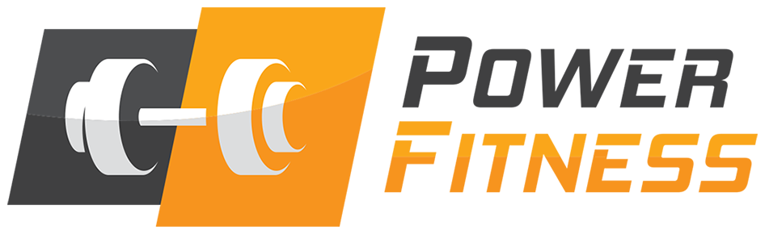
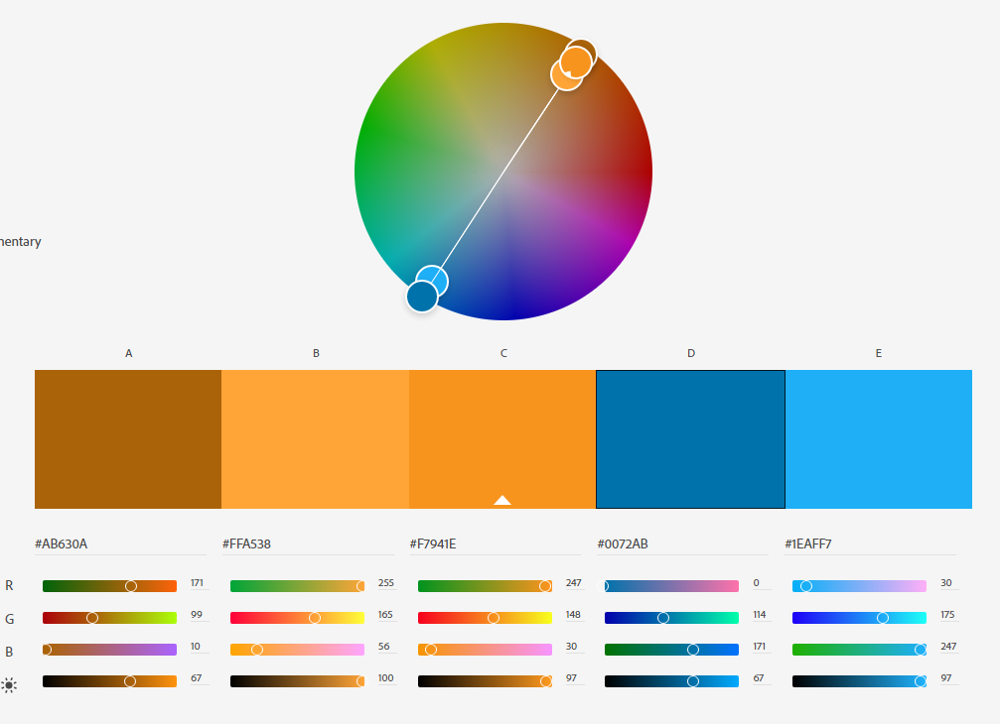
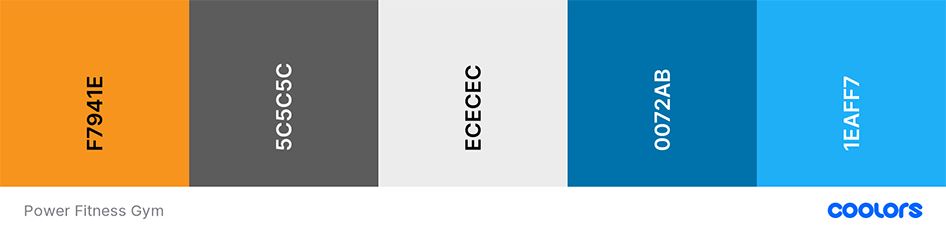
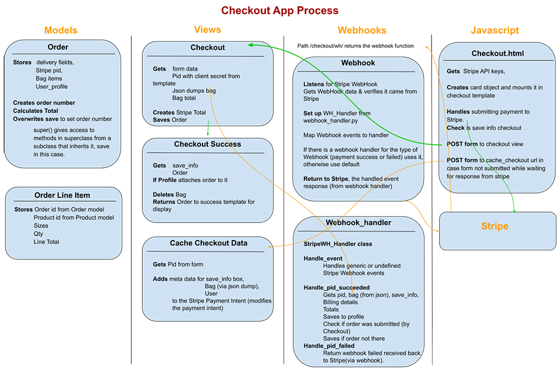

# Milestone 4 - Power Fitness Gym - by Kevin Bourke



Power Fitness Gym is a website where users can search for and purchase fitness products via text search or categories. 

The live deployed site can be found here - https://power-fitness.herokuapp.com/

## Research

I researched numerous gym and eCommerce websites for inspiration for site structure, features and style. A list of the most relevant inspiring sites can be found at the bottom of this document [here](#Design-and-Research). 

I also found a couple of very interesting case studies for designing an eCommerce store, one for a [sporting goods](https://medium.com/swlh/designing-my-first-e-commerce-website-ux-case-study-9c1cd1a9a95) website and another for a [toy store](https://uxdesign.cc/designing-an-e-commerce-site-for-a-toy-store-a-ux-case-study-d244f891d028) site. These gave some great insight into how a professional team of UX designers would approach designing an eCommerce website, from the brief all the way through to layout wireframes.

I tried to keep all of what I liked or learned in mind while going through the following UX process.

## UX

I wanted the site to have 3 main overarching features.
 - [x] Users should be able to browse by category or search the site for products.
 - [x] Users should be able to purchase these products.
 - [x] If they like, users should be able to register and login to the site.
 - [x] Users should have the option to manage their gym membership.

### User Stories

This section provides insight into the UX process, focusing on who this website is for, what it is that they want to achieve and how this project is the best way to help them achieve these things. It expands on the main features as were listed above.


#### As admin or the site owner I would like to do all the above as well as:

- [ ] Edit or Remove products.
- [ ] Edit or remove all categories.


These admin features are not currently developed, but are certainly something a site admin would want to have

#### As a developer

I include this here to explain what I, as a developer, wanted to get out of this project. 

 - To provide an easy to use, online fitness shop, which and provides the shop owner with full CRUD functionality on products.
 - To improve my knowledge of Python and Django with a practical project.
 - To learn about Stripe and webhooks.
 - To learn to deploy the web app through Heroku, and store media on Amazon Web Services.


### Strategy

The goals of this type of website are to:

1. 

### Scope

This section determines what the users should be able to do on the website. Users should be able to:

- [x] Browse products by text search.
- [x] Browse products by category.


### Structure

To list the pages I needed and to visualise the site structure, I designed my visual sitemap in Gloomap. In the sitemap below, the pages marked in green represent site User (logged in) pages:


I also listed out the features I wanted on the homepage:

#### Obvious signposts to Products and Membership


### Skeleton

I sketched up some very rough ideas on paper and then designed the final wireframes, which were created in Balsamiq:

- [Home page on desktop wireframe](README_resources/wireframes/homepage-desktop.png)
- [Home page on mobile wireframe](README_resources/wireframes/homepage-mobile.png)
- [Mobile navigation wireframe](README_resources/wireframes/mobile-nav-open.png)
- [Membership page on desktop wireframe](README_resources/wireframes/membership-desktop.png)
- [Membership page on mobile wireframe](README_resources/wireframes/membership-mobile.png)
- [Products page on desktop wireframe](README_resources/wireframes/products-desktop.png)
- [Single product page on desktop wireframe](README_resources/wireframes/product-single-desktop.png)
- [Single product page on mobile wireframe](README_resources/wireframes/product-single-mobile.png)
- [Shopping bag page on desktop wireframe](README_resources/wireframes/shopping-bag-desktop.png)
- [Shopping bag page on mobile wireframe](README_resources/wireframes/shopping-bag-mobile.png)
- [Checkout page on desktop wireframe](README_resources/wireframes/checkout-desktop.png)
- [Checkout page on mobile wireframe](README_resources/wireframes/checkout-mobile.png)

### Surface

This is the sensory design section of a website, or how it looks, feels and sounds. I wanted the design to be . I created a moodboard with Adobe Spark from research of colours, styles and components to visually illustrate the style I wished to pursue. You can see that [moodboard here.](README_resources/mood-board.png)

I decided my main colour would be orange. Orange is about creativity, enthusiasm, energy and youth according to this [99designs article](https://99designs.ie/blog/tips/color-psychology/). Similarly [this article about the psychology of orange](https://www.rcwilley.com/blogs/Room-To-Talk/34/2017/10/7197/Color-Psychology-Orange-and-Black) also says it's energetic, happy and is associated with celebrations, and stimulation. It is a strong colour that pops and is great for drawing the eye to things like buttons or headings.  I also like how the orange, black and white worked together on [Ben Dunne Gyms](https://www.bendunnegyms.com/), though I would probably want to use a lot more white, so it would not seem like a Halloween theme.

I searched Shutterstock for a gym logo wth orange, and there were a number of logos that used orange and black, from experience fitting a vertical logo into a header can be tricky if you don't want the header to be too tall. With this in mind I chose the power fitness logo which has the logo text horizontal and to the right.

I like how [Planet Fitness](https://www.planetfitness.com/gyms/manhattan-27th-st-ny) used their bright complementary colours of purple and yellow, along with light and dark greys. I researched colour combinations, particularly looking for orange and another cooler complementing colour, which would most likely be a shade of blue. I used [Adobe Color](https://color.adobe.com/create/color-wheel) and set the logo orange in the middle and used the 'Complementary' colour harmony rule to determine the other colours. This gave me my complementary blue colours:



I did not think I would need the additional orange colours so I brought the main orange and the complementary blues into [Coolors](https://coolors.co/), and added a dark grey and a light grey. Along with white and black these would be my colours. Coloors generates a nice pdf palette with lots of different shades of those colours.

This was my final palette:



You can also see it completely in [PDF format here](README_resources/colour-palette-power-fitness-gym.pdf).

#### Fonts

On all the gym and shop websites I researched, I liked the font used on [Ben Dunne Gyms](https://www.bendunnegyms.com/westpoint.aspx) as a heading, as it is strong and bold. 
This [canva article](https://www.canva.com/learn/the-ultimate-guide-to-font-pairing/) also shows a very bold heading font to help represent Sports or Activity (under 03. Sports/active), which is a Google Font called [Archivo Black](https://fonts.google.com/specimen/Archivo+Black), and there is also an [Archivo Narrow](https://fonts.google.com/specimen/Archivo+Narrow) which I thought might work well as a secondary heading. Google fonts has suggestions for pairing fonts, and from those I decided on Source Sans Pro, which is a good sans-serif font for body text, as it is easy to read at smaller sizes.

### Stripe Checkout Functionality

I mapped out in a visual diagram, the process for checkout via Stripe. I have tried to show how data gets passed between Stripe, the views and the webhook handler, and how it is stored in the database. While this is quite broad strokes and lacks a lot of detail, it helped me understand the checkout process much better. Checkout starts when the form is submitted on the /checkout/ page (so starts at checkout.html template). You can see a [pdf of the checkout process here](README_resources/checkout-process-map.pdf) or see an image of it below:



### Database Schema

Based on the functionality required and the data to be stored, I created my database structure. 

### Defensive Design

An important part of UX is making sure users cannot cause errors, and that they get positive useful feedback if they try to perform an action that they are not allowed to. This includes things like:
 - A user cannot break the site (or cause an error appear on screen), by pressing buttons out of expected order, or using browser forward and back buttons.
 - Required Form inputs give warnings or feedback if not filled, or filled correctly.
 - A user is given feedback if they are not allowed to do something, like register an already existing username.
 - A custom '404 page not found' page.
 - Ensure that all orders are entered into our database even in the event of a user error during the checkout process. If the payment form is not submitted for some reason like a user closes the page before the payment is complete, the webhook handler will have this information and create the order in the database.

## Technologies Used

### Languages and Frameworks
1. HTML
2. CSS
3. Javascript 
4. Python
5. [Django Framework](https://docs.djangoproject.com/en/3.1/)
6. [PostgreSQL Database](https://www.postgresql.org/)
7. [Heroku hosting platform](https://heroku.com)
8. [Bootstrap Framework](https://getbootstrap.com/)
9.  [Font Awesome](https://fontawesome.com/)
11. Google Fonts
12. [JQuery](https://jquery.com) - The project uses **JQuery** to simplify DOM manipulation, and animation of certain elements.
13. [RealFaviconGenerator](https://realfavicongenerator.net/) - to quickly generate favicons for all browsers.
    

### Tools Used
1. [VS Code](https://code.visualstudio.com/) and [Brackets](http://brackets.io/) code editors.
2. [Git](https://git-scm.com/) - Installed on local devices and integrated with VS Code and Brackets, to allow version control.
3. [GitHub](https://github.com/) - Used a repository for the project files and previous versions. Also used to deploy the website.
4. [Balsamiq](https://balsamiq.com/) - Used for creating wireframes for different variations and different screen sizes.
5. I used Photoshop and Illustrator for image and svg manipulation.
6. [TinyPNG](https://tinypng.com/) - To keep transparent png sizes to a minimum I used the online png compressing service [TinyPNG](https://tinypng.com/), as well as the desktop application.
7. [Coolor](https://coolors.co/) - Used top help determine the colour scheme.
8. [Gloomaps](https://www.gloomaps.com/) - For creating my sitemap.
9. [ngrok](https://ngrok.com/product) - For testing Stripe webhooks when working locally


## Features
 
### Existing Features

#### The ability to browse/search by product categories that are on the website.


#### The ability to search Products by text keyword. 


#### Users can register a profile on the site.


#### Users can login and logout of the site.

#### When logged in users get addition options in the navigation.


#### Logged in users can change their password.

#### Logged in users can manage categories (but not ).


#### Minor Features

##### Back to top (of page) button

Expand the sections below for more info on details:

<details>
  <summary><strong>Responsive images</strong></summary>


</details>


<details>
  <summary><strong>Skip to main content</strong></summary>

 There is a 'Skip to main content' link just inside the body tag for accessibility for screen readers. The main content is not usually the first thing on a web page. Keyboard and screen reader users generally must navigate a long list of navigation links, sub-lists of links, corporate icons, site searches, and other elements before ever arriving at the main content. This is then hidden from view with the class 'sr-only', however when it receives focus from keyboard it becomes visible. This is based on accessibility recommendations from https://webaim.org/techniques/skipnav/. This can be checked by pressing tab when a pages loads, and then pressing tab again should show the next focused element is on the page content and not the logo or navigation.

 </details>

### Features to consider implementing in the future

 - Allow products to be tagged within multiple categories.
 - Generate thumbnail images for use in shopping bag to prevent loading full size images.

## Testing and Issues

For detail on all my testing and issues I had to overcome see the [Testing Document](TESTING.md).

## Deployment

### 1. Clone from github 
To run locally, you can clone this repository directly into the editor of your choice. Open a folder where you want to save the project to and then in the terminal paste `git clone `. To cut ties with this GitHub repository, type `git remote rm origin` into the terminal. The project will be now cloned into your folder.

### 2. Create database on 


### 3. Install requirements

In terminal type (you might need 'sudo' before the following on some environments):

```
$ pip3 install -r requirements.txt
```

### 4. Create `env.py` file

Create a file named `env.py` in the root directory of your project. This is the file you will use to define your environment variables. We need the following data in the env file:

```
import os

os.environ.setdefault("SECRET_KEY", "YOUR_SECRET_KEY_HERE")
os.environ.setdefault("MONGO_DBNAME", "YOUR_DATABASE_NAME")
os.environ["MONGO_URI"] = ""
```
Replace YOUR_SECRET_KEY_HERE with a random string.
Replace YOUR_DATABASE_NAME with your database name.

You need to get your mongo uri from mongodb. In MongoDB, go to your cluster and click 'connect' button. Select 'Connect your application' from the options. Then select the version of Python you are using, and click the copy button in step 2 to copy the connection string:


Paste it into the right side of the MONGO_URI variable in the env file, and replace `<password>` with the password for your username. Replace `<dbname>` with the name of the database.


### 6. If you want to turn on debug

In the last line of app.py file change from `debug=False` to `debug=True`

### 7. Run the app

You will then be able to run the app locally by typing `python app.py` or  `flask run`. 

## Deployment to Heroku

The web app is hosted on Heroku. The steps to deploy the local app to Heroku are as follows:

### 1. Sign up and log in to Heroku

In Heroku, create an app.  

### 2. Install the Heroku CLI and login
If you do not have it already, download and install the [Heroku CLI](https://devcenter.heroku.com/articles/heroku-cli).
In terminal, login with:

```
$ heroku login
```

and login through the browser/preview window. If you’d prefer to stay in the CLI to enter your credentials, you may run `heroku login -i`

### 3. Connect repo to Heroku

In Heroku go to Settings tab. You will find the Heroku git url here. Then in terminal type:

```
$ git remote add heroku <your heroku git url>
```

Heroku is now set as a remote.  

### 4. Push to Heroku
You can just push the code to Heroku with the command: 
```
$ git push -u heroku master
```

Alternatively, you can also link a Github repository to Heroku to deploy automatically from GitHub, under the Deploy tab. 


### 5. Set environment variables

In the Settings tab, under Config Vars, add the env variables (SECRET_KEY, MONGO_DBNAME, MONGO_URI) we set in the local development, as well as IP to 0.0.0.0 ansd PORT to 5000. Like so:


### 6. Open the App

Back in terminal type:

```
$ heroku ps:scale web=1
```

You should be able to open the app now, or you might need to Restart all Dynos under the 'More' button on the top right in Heroku.

## Credits and References

### Design and Research
 I took inspiration for this site from the following places:
 * https://medium.com/swlh/designing-my-first-e-commerce-website-ux-case-study-9c1cd1a9a95
 * https://uxdesign.cc/designing-an-e-commerce-site-for-a-toy-store-a-ux-case-study-d244f891d028
 * https://www.bendunnegyms.com/westpoint.aspx
 * https://www.planetfitness.com/gyms/manhattan-27th-st-ny
 * https://www.decathlon.ie/
 * https://topfit.qodeinteractive.com/product/equipment/
 * http://gymster.peacefulqode.com/fitness-home/
 * https://www.puregym.com/membership-options/
 * https://apollofitness.ie/collections/home-gym-essentials/products/wooden-gym-rings


### Technical
 - For general references for Python and Django I used my Code Institute notes, [MDN web docs](https://developer.mozilla.org/en-US/), [w3schools](https://www.w3schools.com/js/default.asp), [Python Official Docs](https://www.python.org/doc/), and [Django documentation](https://docs.djangoproject.com/en/3.1/).
 - I also used Django for Beginners book by William S. Vincent for reference.
 - Stripe Webhook Handler - The base code for this came from Stripe's documentation - [Handle webhook events](https://stripe.com/docs/payments/handling-payment-events#signature-checking)
 - Javascript Stripe payment logic - Base code for this came from (Stripe documentation)[https://stripe.com/docs/payments/accept-a-payment]
 - Stripe Subscriptions with Checkout - Base code for this came from (Stripe documentation)[https://stripe.com/docs/billing/subscriptions/checkout]
 
### Content


 
### Media

The photos and vectors used in this site were obtained from:

 - Database Diagram designed on [QuickDBD](https://www.quickdatabasediagrams.com/).
 - Logo was purchased from [Shutterstock](https://www.shutterstock.com/image-vector/) and I edited the colours and added the logo text.
 - 

### Acknowledgements

 - Thanks to my mentor Anthony Ngene for his suggestions and his time.
 - Thanks to those on Slack for reviewing my project and making suggestions.